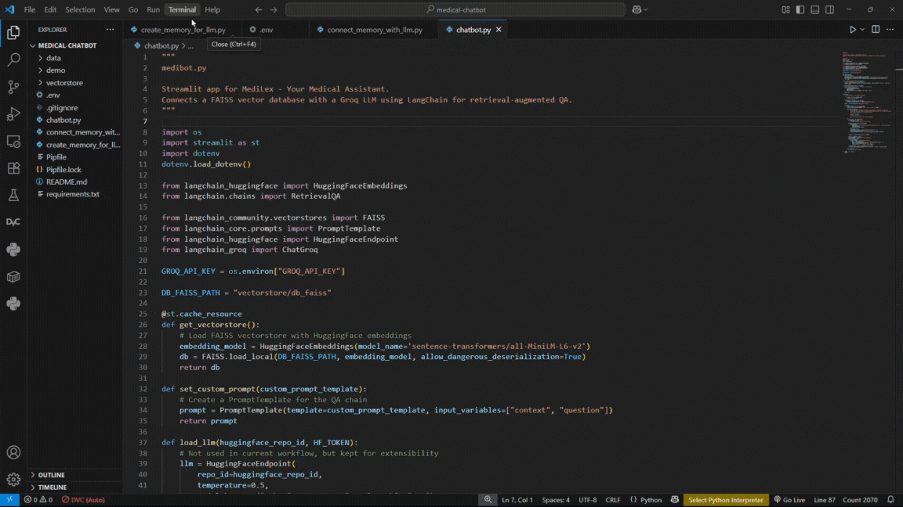

# MediLex - Medical Chatbot

A retrieval-augmented chatbot using LangChain, Groq LLM, and FAISS vector database.
Provides context-aware answers to medical queries using uploaded PDF documents.

## Presentation site
Check out here: [My Canva Portfolio](https://snehpatelaitask.my.canva.site/)

## Features

- Connects a FAISS vector store with a Groq LLM for context-aware QA.
- Uses HuggingFace embeddings for document retrieval.
- Streamlit web interface for interactive chat.
- Customizable prompt template.
- Source document references for each answer.

  
## Project Demo

Below is a screen recording demonstrating the **MediLex** chatbot in action.

<details>
<summary>Click to expand demo video</summary>

<p align="center">
  
</p>

</details>

## Setup

1. **Clone the repository.**
2. **Install dependencies:**

   ```bash
   pip install -r requirements.txt
   ```
3. **Set your Groq API key in a `.env` file:**

   ```
   GROQ_API_KEY=your_api_key_here
   ```
4. **Prepare your PDF data:**

   - Place your PDF files in the `data/` directory.
5. **Create the vectorstore:**

   ```bash
   python create_memory_for_llm.py
   ```

## Usage

### Streamlit Chatbot

Run the Streamlit app:

```bash
streamlit run medibot.py
```

### Command-line QA

You can also run a command-line QA session:

```bash
python connect_memory_with_llm.py
```

## File Structure

- `medibot.py` — Streamlit web app for chat.
- `connect_memory_with_llm.py` — Command-line QA interface.
- `create_memory_for_llm.py` — Script to create FAISS vectorstore from PDFs.
- `vectorstore/` — Stores the FAISS database.
- `data/` — Place your PDF files here.
- `.env` — Store your API keys here (not tracked by git).
- `demo/` — Place your demo GIF or MP4 here.

---

**Note:**
This project is for personal or educational use. No license is provided and no open source rights are claimed.
